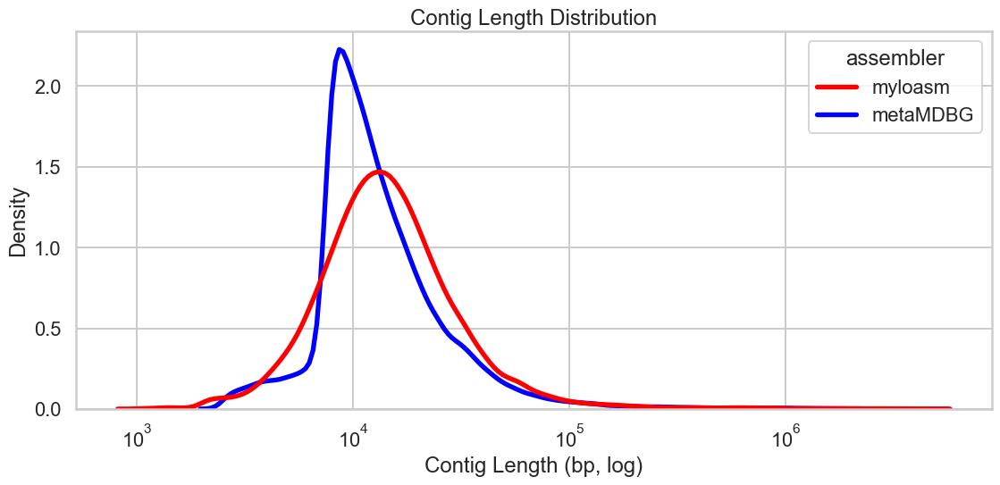
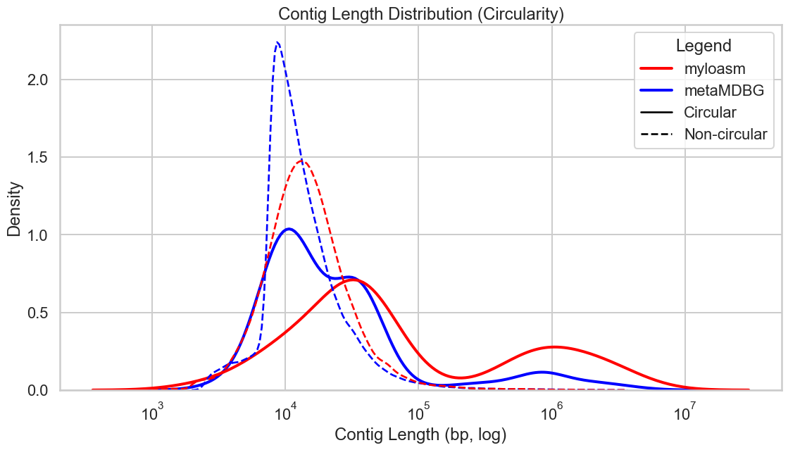
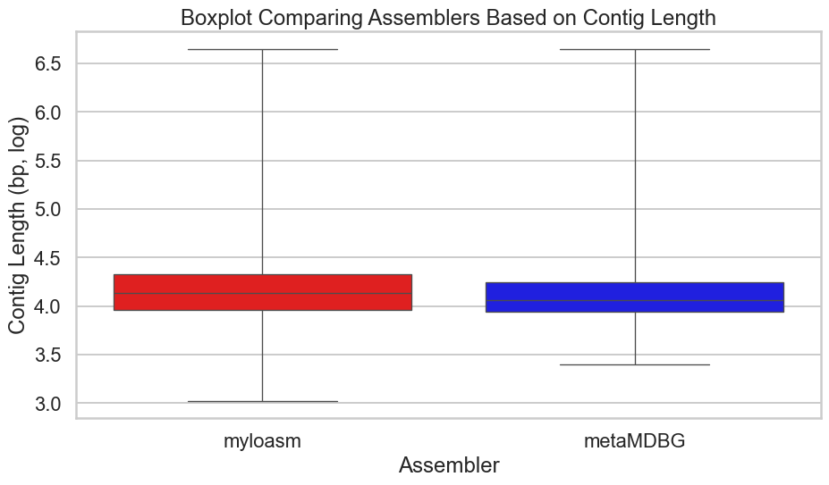
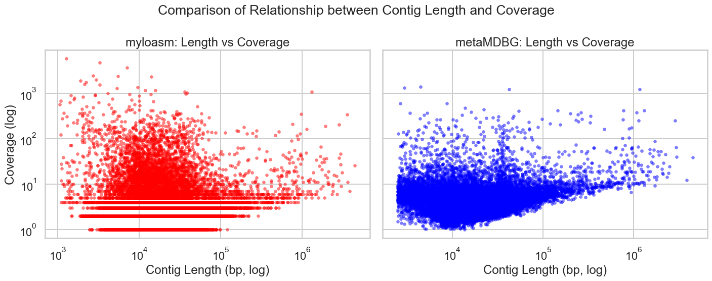

# Comparison of metagenomic assemblers: metaMDBG vs. myloasm
Michal Skotar

## Overview

The goal of this project was to compare the performance of two
metagenomic assemblers, **metaMDBG** and **myloasm**, applied to
nanopore sequencing data from a hot spring microbial community. The
comparison is based on metadata extracted from FASTA headers, CheckM2
quality reports, and GTDBTK taxonomic classifications.

The workflow involves: 1. **Parsing:** Extraction of contig length,
circularity, and coverage data from headers. 2. **Quality Assessment:**
Classification of Metagenome-Assembled Genomes (MAGs) based on
completeness and contamination. 3. **Visualization:** Comparison of
assembly metrics using Python.

## Data Processing

Data processing is handled by the `src` module. Headers, quality
reports, and taxonomy files are loaded, merging them into a single
pandas dataframe.

``` python
# Define paths in a dictionary (Relative to Project Root)
RESULTS_DIR = HERE / "results"

file_paths = {
    'headers_mylo': RESULTS_DIR / 'myloasm_assembly_headers.txt',
    'headers_meta': RESULTS_DIR / 'metamdbg_assembly_headers.txt',
    'checkm2_mylo': RESULTS_DIR / 'checkm2/myloasm/quality_report.tsv',
    'checkm2_meta': RESULTS_DIR / 'checkm2/metamdbg/quality_report.tsv',
    'gtdb_mylo_ar': RESULTS_DIR / 'gtdbtk/myloasm/classify/gtdbtk.ar53.summary.tsv',
    'gtdb_mylo_bac': RESULTS_DIR / 'gtdbtk/myloasm/classify/gtdbtk.bac120.summary.tsv',
    'gtdb_meta_ar': RESULTS_DIR / 'gtdbtk/metamdbg/classify/gtdbtk.ar53.summary.tsv',
    'gtdb_meta_bac': RESULTS_DIR / 'gtdbtk/metamdbg/classify/gtdbtk.bac120.summary.tsv'}

# Compile data using analysis pipeline
df = compile_data(file_paths)
print(f"Data successfully loaded. Total contigs: {len(df)}")
```

    Parsing assembler headers...
    Parsing CheckM2 reports...
    Parsing GTDBTK reports...
    Merging data into a single dataframe...
    Data successfully loaded. Total contigs: 103119

------------------------------------------------------------------------

## 1. Contig Length Distribution

We evaluated the distribution of contig lengths for both assemblers,
distinguishing between circular and non-circular contigs.

``` python
plt.figure(figsize=(12, 6))

sns.kdeplot(
    data=df,
    x="length",
    hue="assembler",
    hue_order=ASSEMBLER_ORDER,
    palette=PALETTE,
    log_scale=True,
    common_norm=False,
    fill=False,
    linewidth=4)

plt.title("Contig Length Distribution")
plt.xlabel("Contig Length (bp, log)")
plt.ylabel("Density")
plt.tight_layout()
plt.show()
```

<div id="fig-dist-total">



Figure 1: Overall distribution of contig lengths for both assemblers.

</div>

### 2. Distribution by Circularity

Here we distinguish between circular (solid line) and non-circular
(dashed line) contigs.

``` python
plt.figure(figsize=(12, 7))

# Circular (full line)
sns.kdeplot(
    data=df[df['is_circular'] == True],
    x="length",
    hue="assembler",
    hue_order=ASSEMBLER_ORDER,
    palette=PALETTE,
    log_scale=True,
    common_norm=False,
    linewidth=3,
    linestyle="-")

# Non-circular (dashed line)
sns.kdeplot(
    data=df[df['is_circular'] == False],
    x="length",
    hue="assembler",
    hue_order=ASSEMBLER_ORDER,
    palette=PALETTE,
    log_scale=True,
    common_norm=False,
    linewidth=2,
    linestyle="--")

# Custom legend to show everything necessary
legend_elements = [
    Line2D([0], [0], color=PALETTE['myloasm'], lw=3, label='myloasm'),
    Line2D([0], [0], color=PALETTE['metaMDBG'], lw=3, label='metaMDBG'),
    Line2D([0], [0], color='black', lw=2, linestyle='-', label='Circular'),
    Line2D([0], [0], color='black', lw=2, linestyle='--', label='Non-circular')]

plt.legend(handles=legend_elements, loc='upper right', title="Legend")
plt.title("Contig Length Distribution (Circularity)")
plt.xlabel("Contig Length (bp, log)")
plt.ylabel("Density")
plt.tight_layout()
plt.show()
```

<div id="fig-dist-circular">



Figure 2: Contig length distribution distinguishing circular and
non-circular contigs.

</div>

### 3. Boxplot Comparison

A boxplot view of the contig lengths (log-transformed) provides a clear
summary of the median and quartiles.

``` python
df_box = df.copy()
df_box['log_length'] = np.log10(df_box['length'])

plt.figure(figsize=(10, 6))

sns.boxplot(
    data=df_box,
    x="assembler",
    y="log_length",
    palette=PALETTE,
    hue="assembler",
    legend=False,
    whis=75)

plt.title("Boxplot Comparing Assemblers Based on Contig Length")
plt.xlabel("Assembler")
plt.ylabel("Contig Length (bp, log)")
plt.tight_layout()
plt.show()
```

<div id="fig-boxplot">



Figure 3: Boxplot of contig lengths (Log scale).

</div>

------------------------------------------------------------------------

## 4. Length vs. Coverage Correlation

We evaluate the relationship between contig length and sequencing
coverage.

``` python
fig, axes = plt.subplots(1, 2, figsize=(15, 6), sharey=True)

# Scatterplot for myloasm
sns.scatterplot(
    data=df[df['assembler'] == 'myloasm'],
    x="length",
    y="coverage",
    ax=axes[0],
    color=PALETTE['myloasm'],
    alpha=0.5,
    s=20,
    edgecolor=None)

axes[0].set_title("myloasm: Length vs Coverage")
axes[0].set_xscale("log")
axes[0].set_yscale("log")
axes[0].set_xlabel("Contig Length (bp, log)")
axes[0].set_ylabel("Coverage (log)")

# Scatterplot for metaMDBG
sns.scatterplot(
    data=df[df['assembler'] == 'metaMDBG'],
    x="length",
    y="coverage",
    ax=axes[1],
    color=PALETTE['metaMDBG'],
    alpha=0.5,
    s=20,
    edgecolor=None)

axes[1].set_title("metaMDBG: Length vs Coverage")
axes[1].set_xscale("log")
axes[1].set_yscale("log")
axes[1].set_xlabel("Contig Length (bp, log)")
axes[1].set_ylabel("")

plt.suptitle("Comparison of Relationship between Contig Length and Coverage", size=20)
plt.tight_layout()
plt.show()
```

<div id="fig-correlation">



Figure 4: Scatter plots showing the relationship between contig length
and coverage.

</div>

------------------------------------------------------------------------

## 5. Large Circular Contigs Analysis

We specifically filtered for **large (\>500 kb) and circular** contigs,
as these represent potential high-quality Metagenome-Assembled Genomes
(MAGs).

**Quality Criteria:** \* **High:** Completeness \> 90% & Contamination
\< 5% \* **Medium:** Completeness \> 50% & Contamination \< 10%

``` python
large_circ = df[df['is_large_circular'] == True].copy()

if len(large_circ) > 0:
    # 1. Quality Barchart
    plt.figure(figsize=(12, 6))
    sns.countplot(
        data=large_circ,
        x="quality_category",
        hue="assembler",
        order=["High", "Medium", "Low"],
        hue_order=ASSEMBLER_ORDER,
        palette=PALETTE)

    plt.title("Quality of Large Circular Contigs (>500kb)")
    plt.xlabel("Quality Category")
    plt.ylabel("Count")
    plt.tight_layout()
    plt.show()

    # 2. Taxonomy Barchart
    plt.figure(figsize=(12, 10))
    order = large_circ['Phylum'].value_counts().index

    sns.countplot(
        data=large_circ,
        y="Phylum",
        hue="assembler",
        order=order,
        hue_order=ASSEMBLER_ORDER,
        palette=PALETTE)

    plt.title("Number of Large Circular Contigs per Phylum", size=20)
    plt.xlabel("Count")
    plt.ylabel("Phylum")
    plt.tight_layout()
    plt.subplots_adjust(left=0.18, right=0.92) # Adjusting margins for long labels
    plt.show()

else:
    print("No large circular contigs found in the dataset.")
```

<div id="fig-quality-taxonomy">

<div class="cell-output cell-output-display">

<div id="fig-quality-taxonomy-1">


(a) Analysis of Large Circular Contigs.

</div>

</div>

<div class="cell-output cell-output-display">

<div id="fig-quality-taxonomy-2">


(b)

</div>

</div>

Figure 5

</div>

## Summary

In light of the above, it can be assessed that both assemblers resulted
in similar contig lengths (see Boxplot). In density plots, it can be
seen that **myloasm** generally produced longer circular contigs
compared to **metaMDBG**. When analysing correlation between contig
length and coverage, it was discovered that there was hardly any
correlation. Comparing the number of large circular contigs based on
quality, it can be seen that **myloasm** outperformed **metaMDbG** in
all three categories (High, Medium, Low). Lastly, **myloasm** had higher
number of large circular contigs per phylum than **metaMDBG** across
(almost) all detected phyla.
